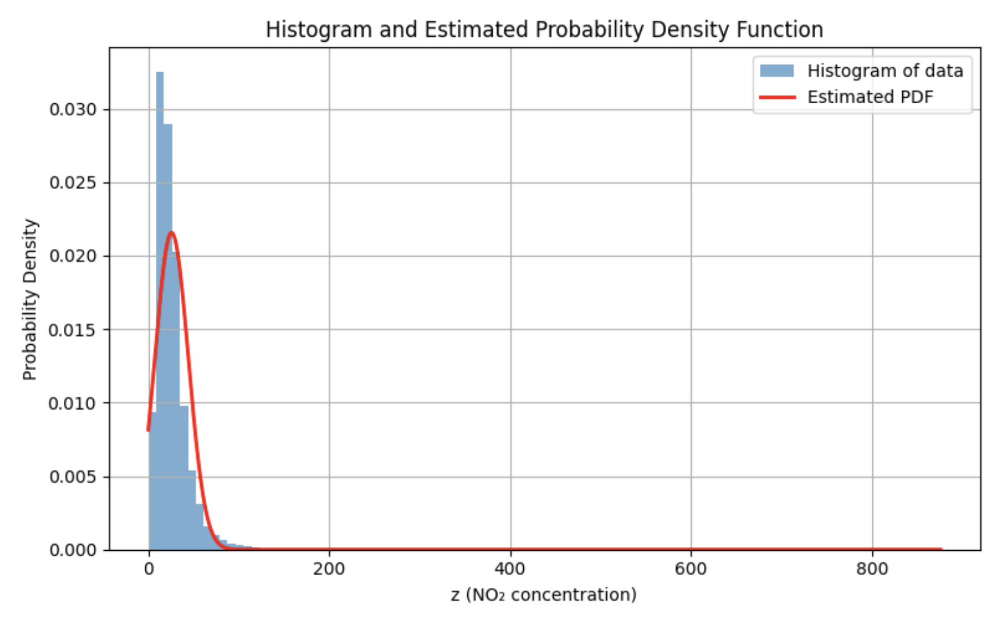

# 📘 Learning Probability Density Functions using a Parameterized Non-Linear Model

This repository presents an implementation for learning a probability density function (PDF) using a parameterized transformation applied to real-world air quality data. The parameters of the PDF are estimated using Maximum Likelihood Estimation (MLE).

## 📌 Objective

The objectives of this assignment are:
- To apply a parameterized non-linear transformation to the NO₂ feature
- To learn the parameters of a given probability density function
- To estimate μ, λ, and c from real data
- To visualize and analyze the learned probability distribution

## 📁 Dataset Information

- Dataset: India Air Quality Data  
- Source: Kaggle  
- Feature Used: NO₂  
- Valid Samples: ~4.2 lakh (after removing missing values)

Only numerical NO₂ values are used in this work.

## 🔢 Parameterized Transformation

The transformation parameters are derived from a university roll number, which is intentionally hidden for privacy.

ar = 0.05 × (r mod 7)  
br = 0.3 × (r mod 5 + 1)

For the parameter values used in this work:
- ar = 0  
- br = 0.3  

## 🔄 Data Transformation

The transformation function is:

z = x + ar · sin(br · x)

Since ar = 0, the transformation simplifies to:

z = x

Thus, the transformed variable is identical to the original NO₂ values for this parameter setting.

## 📐 Probability Density Function

The probability density function to be learned is:

p̂(z) = c · exp(−λ(z − μ)²)

Where:
- μ is the mean of the distribution  
- λ controls the spread  
- c is the normalization constant  

This represents a Gaussian-type distribution.

## 🧮 Parameter Estimation Methodology

The parameters are estimated using Maximum Likelihood Estimation (MLE).  
For a Gaussian-type distribution, MLE provides closed-form solutions:

μ = (1/N) Σ zᵢ  
σ² = (1/N) Σ (zᵢ − μ)²  
λ = 1 / (2σ²)  
c = √(λ / π)

This approach is mathematically optimal, computationally efficient, and numerically stable.

## 📊 Results

Estimated PDF Parameters:

| Parameter | Value (Approx.) |
|----------|----------------|
| μ        | 25.81          |
| λ        | 0.00146        |
| c        | 0.02156        |

These parameters define the learned probability distribution of NO₂ concentrations.

## 📈 Result Visualization

The figure below shows the histogram of NO₂ values along with the estimated probability density function.

### Interpretation

- The histogram represents the empirical distribution of the data  
- The estimated PDF is a smooth Gaussian-like curve  
- The PDF closely follows the overall trend of the data  
- Minor deviations are expected due to real-world data skewness  

## 📝 Observations

- The transformation reduces to identity for the chosen parameters  
- The methodology remains valid for other parameter values  
- The learned PDF is properly normalized  
- No iterative optimization or machine learning model is required  

## ✅ Conclusion

This project demonstrates real-world data preprocessing, parameterized feature transformation, analytical probability density estimation, and statistically sound modeling using Maximum Likelihood Estimation. The approach is simple, efficient, and suitable for large-scale datasets.

## 📂 Repository Structure

1. main.py  
2. pdf_plot.png 
3. README.md 
